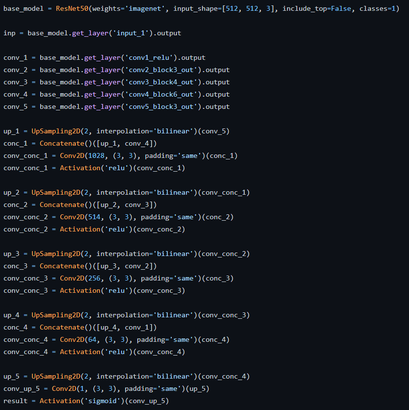
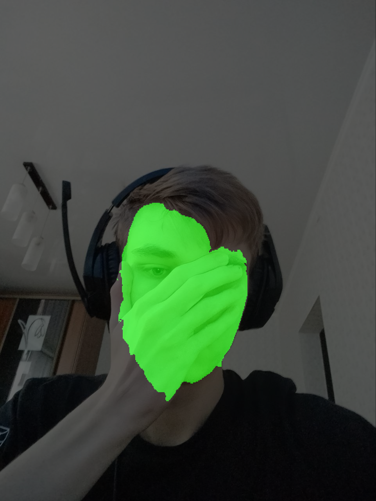
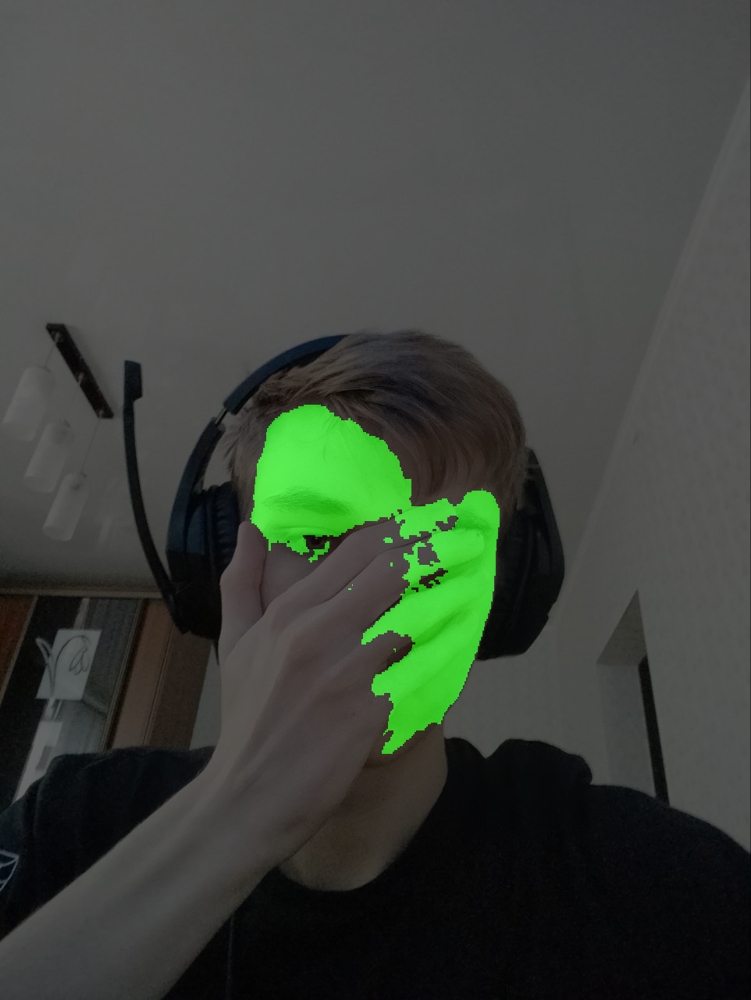
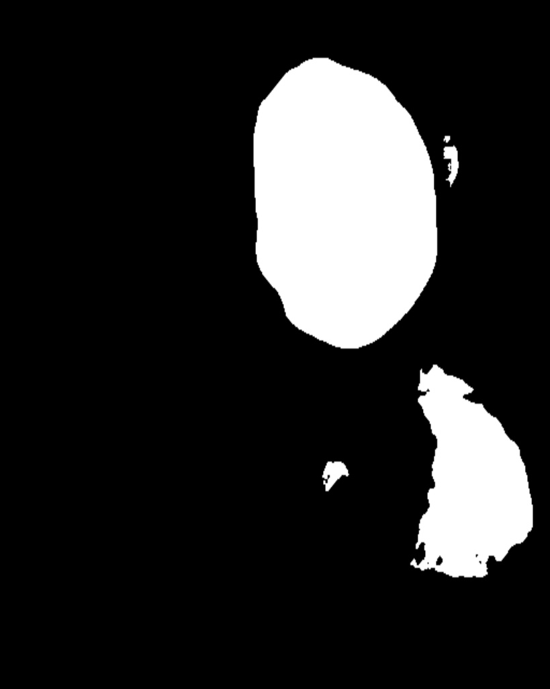

# face-segmentation by Ковалёв Александр Евгеньевич

## Последовательное описание решения

### Подготовка данных 
1. Был использован датасет [CelebAMask-HQ dataset](https://github.com/switchablenorms/CelebAMask-HQ)

А также датасет с самостоятельно аугментированными руками, о которых будет рассказано нижe.

[CelebAHand-face dataset](https://drive.google.com/file/d/1BSqPgUhK8Bhwz68yahwFq0iDcFsIDYwr/view?usp=sharing)

[CelebAHand-mask dataset](https://drive.google.com/file/d/1qKVpC4qJAhVW4HRFgHrtcAsJA0aMyezz/view?usp=sharing)

2. `prepropess_data.py` был взят из репозитория, указанного в ТЗ, затем переписан так, чтобы лицо и его элементы получало значение 255, а все остальные объекты получали значение 0.
    Используйте этот скрипт по форме, чтобы запустить генерацию масок в установленном формате: 
```
python preprocess_data.py --masks_parts <your path> --output_mask <your path>
```

### Обучение
Из-за отсутсвия requirements.txt файла в репозитории в ТЗ запуск обучения оказался крайне мучительным, поэтому было принято решение
самостоятельно написать модель для сегментации изображения. За основу архитектуры был взят ResNet50.

**Архитектура**:

    Скрипт для запуска обучения:
```
python train.py --batch_size <number> --faces_dir <your path> --masks_dir <your path> --fahand_dir <your path> --mahand_dir <your path> --weights_dir <your path>
```
Если 4 из этих параметра весьма понятны, то fahand_dir и mahand_dir могут оставаться загадкой.
Чтобы понять их предназначение перейдем к следующему этапу.

### Аугментация
1. После завершения обучения было выявлено, что рука также распознается как лицо. 
<p align="center">
	
</p>
    В попытках решить данную проблему было принято решение использовать кусочек [EgoHands dataset](https://public.roboflow.com/object-detection/hands) 
    с кропнутыми руками и наложенными масками.
    
<table>

<tr>
<th>&nbsp;</th>
<th>Hand</th>
<th>Mask</th>
</tr>

<tr>
<td><em>Example</em></td>
<td></td>
<td></td>
</tr>

</table>

2. Переход к этапу аугментации. Берем начальный датасет лиц, накладываем на случайную картинку в случайном месте руку, изменяя уже созданную маску.
   Каждая рука была поворачивалась на 0, 90, 180 и 270 градусов и каждое положение использовалось по 5 раз на случайных картинках.
   Тем самым удалось нарастить датасет из 196 рук до 4447 картинок лиц и масок с наложенными руками. 
<table>

<tr>
<th>&nbsp;</th>
<th>Face_hand</th>
<th>Mask_hand</th>
</tr>

<tr>
<td><em>Example</em></td>
<td></td>
<td></td>
</tr>

</table>

Как итог данный подход смог показать себя на тестовых данных с моим лицом не так хорошо, как хотелось, но руку модель все же научилась обходить хотя бы частично.


Итоговый датасет с руками уже прикреплен в разделе Подготовка данных и проводить аугментацию вручную заново не нужно. 
Но если вам интересен сам процесс того, как я это делал, то необходимый код находится в `hand_generator.ipynb`

fahand_dir - путь к лицам с наложенными руками

mahand_dir - путь к маскам лиц с наложенными руками

### Ошибка
1. Логи обучения вы можете найти здесь, на W&B: [Train and val loss](https://wandb.ai/rbd/Face-segmentation?workspace=user-rbd)

   Изначально в каждой эпохе обучения использовалось 1500 шагов с батч_сайзом = 12. 
   Во время исполнения второй эпохи изменение loss почти не происходило. Поэтому на w&b вы увидите 10 эпох по 200 шагов с батч_сайзом=12 для более последовательного отображения. 
   Из-за затрат по времени и ресурсам прогон по всем картинкам, можно сказать, осуществлялся всего один раз за одно обучение. 

2. Порой открытая часть тела человека может также распознаваться как лицо (как на примере часть грудной клетки девушки распозналась как лицо). Причина - недостаточно данных.
<table>

<tr>
<th>&nbsp;</th>
<th>Original</th>
<th>Bad mask</th>
</tr>

<tr>
<td><em>Example</em></td>
<td></td>
<td></td>
</tr>

</table>


### Тест
1. Для теста вы можете использовать один из наборов весов:

   [Обучение без аугментации](https://drive.google.com/file/d/1yPdTrzTOd1VB5sv3tHsdNhZ6ZbxMKrwL/view?usp=sharing)

   [Обучение с аугментацией](https://drive.google.com/file/d/1uMSdmYEQXb6wNaq_Bd461B0nDlFJxL_a/view?usp=sharing)
2. На вход подается изображение, на выходе получается бинарная маска. Использовались не 0 и 1, а 0 и 255 для лучшей визуализации. Происходит ресайз с (512, 512) до размера
изначальной картинки, что была подана на вход.
 
Скрипт для получения масок лиц изображения/изображений:
```
python test.py --weights_path <your path> --images_path <your path> --save_path <your path>
```