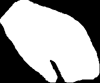

# face-segmentation by Ковалёв Александр Евгеньевич

## Последовательное описание решения

### Подготовка данных 
1. Был использован датасет [CelebAMask-HQ dataset](https://github.com/switchablenorms/CelebAMask-HQ)
2. `prepropess_data.py` был взят из репозитория, указанного в ТЗ, затем переписан так, чтобы лицо получало значение 255, а все остальные объекты получали значение 0.
    Используйте этот скрипт по форме, чтобы запустить генерацию масок в установленном формате: 
```
python preprocess_data.py --masks_parts <your path> --output_mask <your path>
```

### Обучение
Из-за отсутсвия requirements.txt файла в репозитории в ТЗ запуск обучения оказался крайне мучительным, поэтому было принято решение
самостоятельно написать модель для сегментации изображения. За основу архитектуры был взят ResNet50.
    Подробнее с архитектурой вы можете ознакомиться в файле `train.py`.
    Скрипт для запуска обучения:
```
python train.py --batch_size <number> --faces_dir <your path> --masks_dir <your path> --fahand_dir <your path> --mahand_dir <your path> --weights_dir <your path>
```
Если 4 из этих параметра весьма понятны, то fahand_dir и mahand_dir могут оставаться загадкой.
Чтобы понять их предназначение перейдем к следующему этапу.

### Аугментация
1. После завершения обучения было выявлено, что рука также распознается как лицо. 
<p align="center">
	
</p>
    В попытках решить данную проблему было принято решение использовать кусочек [EgoHands dataset](https://public.roboflow.com/object-detection/hands) с кропнутыми руками и наложенными масками 
<table>

<tr>
<th>&nbsp;</th>
<th>Hand</th>
<th>Mask</th>
</tr>

<tr>
<td><em>Example</em></td>
<td></td>
<td></td>
</tr>

</table>

2. Переход к этапу аугментации. Берем начальный датасет лиц, накладываем на случайную картинку в случайном месте руку, изменяя уже созданную маску.
   Каждая рука была поворачивалась на 0, 90, 180 и 270 градусов и каждое положение использовалось по 5 раз на случайных картинках.
   Тем самым удалось нарастить датасет из 196 рук до 4447 картинок лиц и масок с наложенными руками. 
<table>

<tr>
<th>&nbsp;</th>
<th>Face_hand</th>
<th>Mask_hand</th>
</tr>

<tr>
<td><em>Example</em></td>
<td></td>
<td></td>
</tr>

</table>